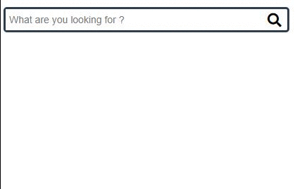

# Vue Advance Search Box

**Advanced and fully customizable search box.**
###Features:
1. Placeholder replaceable.
2. Icons replaceable.
3. Fully access over styling.
4. Bold text on items according to the search value.
5. Access Over ***on-typing*** Event.
    * on-typing event call when user stop typing on search box ***(Will avoid sending lot of requests to server)***.
6. Access over ***enter-press*** press event.
   

### Installation

```
npm install vue-advance-search-box
```

### Demo Example



### Properties

prop | type | Default | Description
-----|-----|----------|------------
searchResults | Array | null | Array with items that was found after search.
isSearching  | Boolean | false | For showing "Load Icon" when finding items in progress.
disabled  | Boolean | false | For disabling search box. Will not allow to write anything and feels like disabled.
onSelectHideList  | Boolean | false | For Hiding searched items when user select any item from list.
placeholder  | String | What are you looking for ? | Placeholder on search box.
searchNotFound  | String | Not Found. | When items not found after search.
addClass | String | null | Add extra class for style or any other purpose if needed.
iconSearch | String | empty | For Showing search icon on search box.
iconCancel | String | empty | For Showing cancel icon on search box for removing current search value. It will be btn with icon.
iconLoader | String | empty | For Showing loader icon on search box when searching items in progress.
enter-press | function | -- | Call your function when user press enter on search box.
on-typing | function | -- | Call your function while user typing on search box.
option-select | function | -- | Call your function with parameter when user select any item from list. It will give selected "value and text".

### Example Code Basic

```Vue

<template>
  <SearchBar
      @enter-press="onEnter"
      @on-typing="onTyping"
      v-model="searchText"
      :is-searching="searching"
      :search-results="searchedItems"
      @option-select="selected"
      icon-search="fa fa-search"
      icon-cancel="fa fa-times"
      icon-loader="fas fa-circle-notch fa-spin"
  />
</template>
```

> ***NOTE***:  It's not mandatory to send icons code only for FontAwesome. You can pass any other library code that you are using in your project.
```Vue

<script>
import SearchBar from './components/SearchBar.vue'

export default {
  name: 'App',
  components: {
    SearchBar
  },
  data() {
    return {
      searchedItems: [], //Ex: [{value:'something', text: 'Some Text..'}]
      searchText: '',
      searching: false, //When it's true "Loader" icon will show on search box.
    }
  },
  methods: {
    onEnter() {
      //Function will run on enter key press.
      this.getData();
    },
    onTyping() {
      //Function will quickly run when user stop typing on search box.
      this.getData();
    },
    selected: function (value, text) {
      //Selected item "Value and Text" will receive in this function via params.
      console.log(value, text);
    },
    getData() {
      //Getting data from API and filling items in "searchedItems"
      let self = this;
      self.searching = true;
      fetch('https://www.thecocktaildb.com/api/json/v1/1/search.php?s=' + this.searchText)
          .then(response => response.json())
          .then(json => {
            self.searchedItems = [];
            let data = json.drinks;
            if (data != null) {
              data.forEach(function (obj) {
                self.searchedItems.push({'value': obj.idDrink, 'text': obj.strDrink + ' ' + obj.strCategory});
              });
            }
            self.searching = false;
          });
    }
  }
}
</script>
```
### Example Code with all available features:
```Vue
<SearchBar
        placeholder="Find anything you want .."
        :search-results="searchedItems"
        v-model="searchText"
        @enter-press="onEnter"
        @on-typing="onTyping"
        @option-select="selected"
        :on-select-hide-list=true
        :disabled=false
        add-class="extra-class"
        :is-searching="searching"
        :search-not-found="'Not Found: '+searchText"
        icon-search="fa fa-search"
        icon-cancel="fa fa-times"
        icon-loader="fas fa-circle-notch fa-spin"
>
</SearchBar>
```

>***NOTE:*** **You can put your own style on each and everything** by passing your own class inside *add-class*